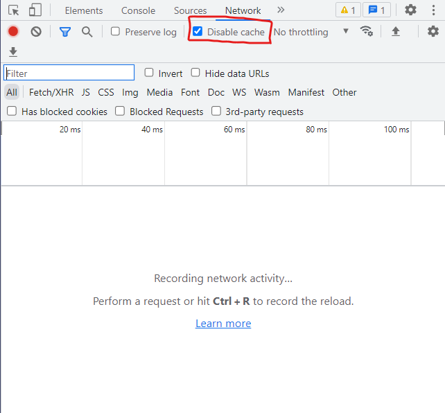

## 개요

Django 프로젝트를 하면서, 템플릿을 수정할 때 마다 페이지를 새로고침 해야 하는 일이 빈번했기 때문에, 자동으로 reload 되는 모듈이 있나 찾아봤다.

## django-browser-reload

### 설치

1. pip로 설치


```bash
$ python -m pip install django-browser-reload
```
[pip install이 아닌 python -m pip install을 사용하는 이유](../Python/pip.md)


2. `INSTALLED_APPS`에 `django-browser-reload` 추가

```python
# settings.py

INSTALLED_APPS = [
    ...,
    "django_browser_reload",
    ...,
]
```

3. `root urls`에 `path` 추가

```python
# root urls.py

urlpatterns = [
    ...,
    path("__reload__/", include("django_browser_reload.urls")),
]
```

4. `middleware` 추가

```python
# settings.py

MIDDLEWARE = [
    # ...
    "django_browser_reload.middleware.BrowserReloadMiddleware",
    # ...
]
```

<details>
<summary>middleware란?</summary>
<div>
  <ul>
    <li>http 요청 / 응답 처리 중간에서 작동하는 시스템이다.</li>
    <li>DJango는 http 요청이 들어오면 미들웨어를 거쳐서 해당 URL에 등록되어 있는 뷰로 연결해주고, http 응답 역시 미들웨어를 거쳐서 내보낸다.</li>
    <li>http request가 들어오면 위에서부터 아래로 미들웨어를 적용시킨다</li>
    <li>http response가 나갈 때 아래서부터 위로 미들웨어를 적용시킨다</li>
    <li>즉, http 요청 및 응답의 전처리 역할을 한다.</li>
  </ul>
</div>
</details>
<br>

5. static의 css 수정사항 바로 적용 방법

  `django-browser-reload`는 `템플릿의 수정 사항`을 적용시킨다.

  하지만 보통 css는 `static`에 저장해서 관리하는데, static 파일들은 `cache`에 저장되기에

  위 방법으로는 css 수정 사항이 생길 때는 적용이 안된다.

  그래서 이 때는 개발자 도구에서 `Network`탭의 `Disable cache`를 체크하면 될거 같다. (일단 테스트 할 때는 바로 적용이 됨)

  