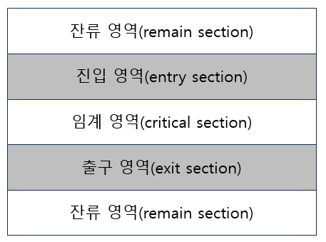

# 임계영역, 세마포어, 뮤텍스, 스핀락

## 임계영역

프로세스의 영역 중에서 공유 자원을 접근하는 코드 영역을 임계 영역 이라고 부른다.

모든 프로세스가 임계 영역을 가지고 있는 것은 아니지만 자원을 공유 하면서 병행적으로 실행되는 프로세스들은 반드시 임계 영역을 가지고 있다.



### 해결책

- 상호 배제 조건
    - 두 개 이상의 프로세스가 임계 영역에 동시에 존재해서는 안 된다.
- 진행 조건
    - 즉, 어느 프로세스도 임계 영역에 진입하지 못하도록 해서는 안 된다.
- 제한된 대기 조건
    - 어떤 프로세스가 임계 영역에 진입을 원할 경우 무한정 기다리게 해서는 안 된다.

## 세마포어

세마포어는 임계 영역을 해결하기 위한 가장 일반적으로 사용되는 소프트웨어 방식이다.

세마포어는 초기 값을 부여한 후, 오직 P, V 연산자에 의해서만 변경할 수 있는 정수형 변수다.

여기서 연산자 P, V는 네덜란드어의 Proberen(검사하다)와 Verhogen(증가하다)에서 유래한 것이며, 각각 영어의 Wait(기다리다)와 Signal(신호를 전하다)의 의미를 갖는다.

예를 들어 세마포어 변수 S에 대한 P(S), V(S) 연산은 다음과 같이 정의한다.

```
P(S): while(S <= 0);
    S = S - 1;
```

```
V(S): S = S + 1;
```

일반적으로 세마포어의 값이 0이면 임계 영역에 접근을 막고, 0보다 크면 접근함과 동시에 1 감소시킨다.

또 임계 영역에서 벗어날 때는 1 증가시켜 다른 프로세스가 접근할 수 있도록 한다.

P(S)에서는 세마포어 변수 S가 0 이하일 때는 while 무한 루프를 돌면서 대기하고, 0보다 크면 S를 1 감소시키면서 임계 영역에 접근한다.

V(S)에서는 임계 영역에서 벗어나면서 1 감소시킨 S를 다시 1 증가시킨다.

즉 프로세스가 임계 영역에 진입할 때 P 연산을 하고, 프로세스가 임계 영역을 벗어날 때 V 연산을 한다.

## 뮤텍스

뮤텍스는 여러 스레드를 사용하는 환경에서 자원에 대한 접근을 강제하기 위한 동기화 기법이다.

Lock 기법을 통해 임계 영역으로의 접근을 관리하는데 오직 하나의 스레드만이 임계 영역에 접근하면서 lock을 걸어 다른 스레드가 임계 영역으로의 접근을 막고, 오직 해당 스레드만이 unlock을 통해 걸어두었던 lock을 해제할 수 있다.

세마포어의 경우에는 여러 프로세스가 임계 영역에 접근할 수 있는 반면에 뮤텍스는 하나의 스레드만 임계 영역에 접근할 수 있다.

세마포어 변수가 1인 세마포어가 뮤텍스라고 할 수 있다.

## 스핀 록

A 프로세스가 임계 영역에 있을 경우, 임계 영역에 진입을 원하는 B 프로세스는 진입 영역에서 무한 루프를 돌면서 진입 조건이 만족될 때까지 진입 조건을 반복적으로 검사하게 된다.

그러나 진입 조건은 A 프로세스가 임계 영역에서 벗어날 때에 만족될 수 있다.

이와 같이 어떤 프로세스가 CPU를 사용하면서 무한정 기다리는 현상을 스핀 록 혹은 바쁜 대기라고 부른다.

이러한 현상은 CPU의 이용률을 저하시키는 요인이 되기 때문에 해결하기 위한 방법이 필요하다.

스핀 록을 해결하기 위해서는 대기 큐를 사용할 수 있다.

어떤 프로세스가 진입 조건을 만족하지 않으면 그 프로세스는 대기 상태로 변환되어 대기 큐에서 기다리게 하고

출구 영역에서는 대기 큐에서 기다리고 있는 프로세스를 준비 상태로 변환시킴으로써 임계 영역에 진입하도록 한다.