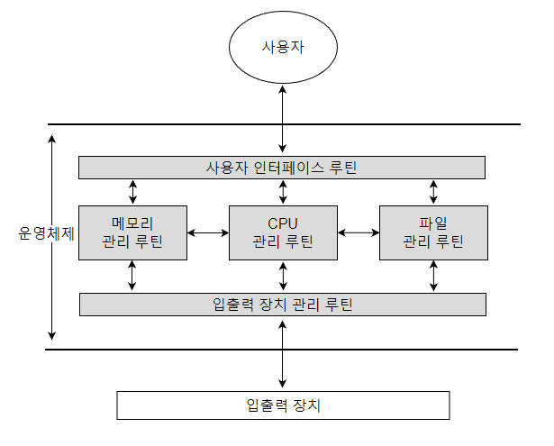
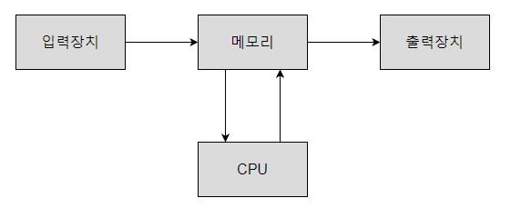

# OS란 무엇인가

## OS의 목적

컴퓨터에는 `CPU`, `메모리`, `디스크`, `I/O`, `서비스 루틴과 같은 소프트웨어` 등 많은 자원들이 존재한다.

이러한 자원들은 컴퓨터마다 보유하고 있는 종류는 다양하지만 그 보유량은 모두 `제한적`이다.

따라서 컴퓨터를 보다 `경제적으로 이용`하기 위해 `제한된 자원`들에 대한 `효율적인 관리` 기능이 요구된다.

그렇게 해서 나온것이 `OS`다.

> OS는 컴퓨터 시스템 자원을 효율적으로 관리하고 사용자에게 편의성을 제공하기 위하여 루틴들이 유기적으로 결합된 프로그램이다.

## OS 구성요소

OS의 구성요소로는 일반적으로 `CPU 관리 루틴`, `메모리 관리 루틴`, `파일 관리 루틴`, `입출력 장치 관리 루틴`, `사용자 인터페이스를 담당하는 루틴`으로 구성된다.

## 컴퓨터 동작원리

`CPU`는 컴퓨터에서 가장 중요한 장치로써 `메모리에 존재`하는 `명령어(instruction)`를 `처리`한다.

CPU는 CPU 내부에 위치한 `PC(Program Counter)레지스터`를 이용하여 `다음 실행할 명령어를 읽어온다.`

결국 컴퓨터에 전원이 들어오는 순간부터 꺼질 때까지 `CPU는 PC 레지스터 값에 해당되는 메모리 주소의 명령어 처리를 반복`한다.

따라서 컴퓨터의 동작원리를 요약하자면 다음과 같다.

1. 입력장치를 통해 CPU 명령어들을 `메모리에 적재`시킨다.
2. CPU로 하여금 그 명령어들을 `하나씩 처리`한다.
3. 출력장치로 그 결과를 출력하도록 `PC 레지스터 값을 조작`한다.

위 과정을 확인하기 위해 컴퓨터가 부팅되는 과정을 간단히 살펴보자

## 부팅 과정

인텔 계열의 CPU 내부에는 `CS, EIP 레지스터`가 PC 레지스터의 역할을 한다.

전원을 켜는 순간 CS:EIP 레지스터의 초기값은 F000:FFF0로 설정되어 FFFF0 번지의 명령어를 읽어 와서 처리하려고 한다.

따라서 FFFF0 번지에 CPU가 처리할 수 있는 명령어가 있어야 한다.

이곳에 있는 명령어가 바로 `BIOS(Basic Input Output System)`라고 말하는 프로그램의 시작이다.

전원이 켜지기 전부터 BIOS가 메모리에 적재되어야 함으로 비휘발성 메모리인 ROM을 사용해서 일반적으로 `ROM-BIOS`라고 부른다.

이어서 순차적으로 ROM-BIOS 프로그램의 마지막 명령어 까지 실행될 것이다.

BIOS의 마지막 명령어는 부팅 디바이스(SSD, HDD)로부터 `부트 프로그램(boot program)`을 메모리 7C00 번지에 적재하고 CS:EIP 레지스터의 값을 07C0:0000으로 설정한다.

부트 프로그램은 부팅 디바이스로부터 OS를 메모리에 적재한 후 CS:EIP 레지스터의 값을 OS가 있는 메모리 주소로 설정함으로써 `OS프로그램이 초기화` 된다.

그 후에는 사용자로부터 `명령어를 받기 위해` 무한루프를 돌면서 대기한다.

이 단계가 바로 `"컴퓨터가 정상적으로 부팅되었다"` 라고 말한다.

## 부팅 후

정상적으로 부팅된 후 사용자가 어떠한 프로그램을 실행시키고자 할 때는 단순히 해당 프로그램의 아이콘을 `더블 클릭`하면 된다.

사용자가 더블 클릭한 프로그램이 실행되기 위해서는 앞서서 설명한 부팅과정과 동일하게 디스크에 저장된 프로그램을 메모리에 적재시키고, CS:EIP 값을 해당 주소로 설정되어야 한다.

이러한 `복잡하고 어려운 과정`을 `OS가 서비스`해 주고 있기 때문에 사용자는 컴퓨터에서 프로그램을 쉽게 실행시킬 수 있는 것이다. 

사용자가 더블 클릭했을 경우 OS에 의해 처리되는 일들은 아래와 같다.

1. 마우스의 더클 클릭 인터럽트 처리 (인터럽트 처리 루틴)
2. 더블 클릭한 아이콘에 해당하는 프로그램을 디스크에서 찾기 (파일 시스템 루틴)
3. 프로그램을 메모리에 적재하기 위해 빈 공간 찾기 (메모리 관리 루틴)
4. 디스크로부터 프로그램을 메모리로 적재 (입출력 장치관리 루틴)
5. CS:EIP 값 조작 (CPU 관리 루틴)

이와 같이 OS에서 다양한 서비스들을 제공하기 때문에 사용자들은 컴퓨터를 `보다 쉽게` 사용할 수 있게 된다.