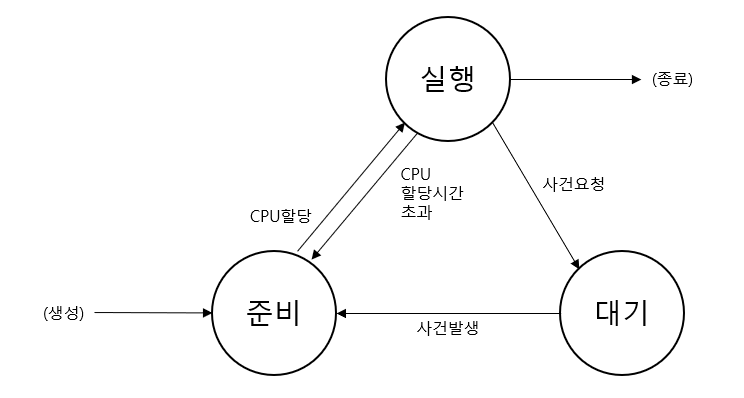
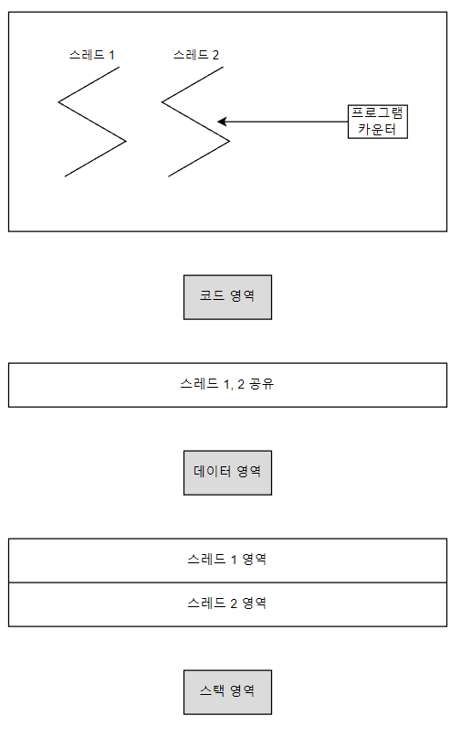

# 프로세스 / 스래드

## 프로세스

### **정의**

프로세스는 컴퓨터 시스템 내부의 `생명체`와 같은 것으로 흔히 컴퓨터 시스템이 살아있다 라고 말하는 것은 적어도 하나의 프로세스가 존재함을 의미한다.

프로세스는 OS에서 다양한 개념으로 정의하고 있지만 일반적으로는 `실행 중인 프로그램`으로 정의한다.

### **프로세스 상태**

프로세스는 상태를 가지고 있다.

마치 하나의 생명체가 태어나서 죽을 때까지 `생명 주기(life cycle)`를 거치는 것처럼 프로세스도 OS에 의해 생성되어 실행되다가 종료할 때까지 `여러 가지의 상태`를 거치게 된다.

프로세스의 상태는 다음과 같다.

- `준비(ready)`: CPU가 할당되기를 기다리고 있는 상태
- `실행(running)`: CPU가 할당된 상태
- `대기(waiting)`: 요청한 사건(ex. 입출력)이 발생되기를 기다리고 있는 상태

1. 프로세스가 생성되면 `준비상태`에서 `CPU의 할당을 기다린다`.
2. OS는 준비상태에 있는 여러 프로세스들 중에서 `우선순위가 가장 높은` 프로세스를 선정 후 CPU를 `할당`한다.
3. CPU가 할당된 프로세스는 준비상태에서 실행상태로 변환된다.

*※ 시분할(time-sharing) 시스템을 위한 OS에서는 하나의 프로세스가 CPU를 너무 오랫동안 사용하는 것을 방지하기 위해 `CPU 할당시간`이 존재한다.*

4. 실행상태의 프로세스가 `정상적으로 실행을 완료`할 경우 그 `프로세스는 종료`된다.

그러나 프로세스가 실행되는 과정에서 `어떤 사건(ex. 입출력)을 요청`할 경우 `대기상태`로 변환되거나

주어진 CPU 사용시간 동안 `완료하지 못했을 경우` `다시 준비상태`로 변환된다.

다중 프로그래밍 환경에서는 여러 개의 프로세스가 존재할 수 있지만 하나의 CPU를 경쟁적으로 사용하기 때문에 실제적으로 실행중인 프로세스는 하나다.

### **프로세스 영역**

[디스크에 존재하는 프로그램이 실행되기 위해서는 우선적으로 그 프로그램이 반드시 메모리에 적재되어 프로세스 형태로 존재해야 한다.](./os.md)

이때 메모리에 있는 프로세스의 구조는 디스크에 존재하는 프로그램의 구조와는 다르다.

`프로그램은 코드 영역과 데이터 영역`으로 구성되지만 프로세스는 다음과 같은 세 가지 영역으로 구성된다.

- `코드(code) 영역` : 프로그램의 `코드(명령어)`가 저장된 영역
- `데이터(data) 영역` : 프로그램의 `데이터`가 저장된 영역
- `스택(stack) 영역` : 프로그램이 실행되는 과정에서 `일시적인 데이터`(ex. 함수 호출에 대한 반환주소)를 저장하기 위한 영역. *프로세스 실행 시 크기를 알 수 있다.*

## 스레드

### **정의**

스레드의 사전적 의미는 '실' 혹은 '실타래'로서 한 가닥으로 감겨진 실타래(`단일 스레드`)와 여러 가닥으로 감겨진 실타래(`다중 스레드`)를 생각해 볼 수 있다.

스레드는 프로세스와 매우 유사한 속성을 가지고 있으며 일반적으로 다음과 같이 다양하게 정의된다.

- CPU 제어의 흐름
- 실행 단위
- 한 프로세스 내부에서 스케줄링이 가능한 개체

스레드는 `프로세스 내부`에 존재하며 프로세스 내부에는 기본적으로 `하나의 스레드`가 존재한다.

프로세스 내부에 오직 하나의 스레드만을 허용하는 단일 스레딩일 경우에는 스레드 개념을 별도로 언급할 필요가 없다.

그러나 다수의 스레드를 허용하는 다중 스레딩에서는 스레드 단위로 스케줄링하여 CPU를 할당하기 때문에 스레드들을 구별할 필요가 있다.

### **다중 스레딩**

프로세스가 생성될 때 기본적으로 하나의 스레드가 존재하지만 실행되는 과정에서 새로운 스레드를 생성할 수 있다.

이때 동일한 프로세스에서 생성된 스레드들은 해당 프로세스의 `모든 자원을 공유`한다.

