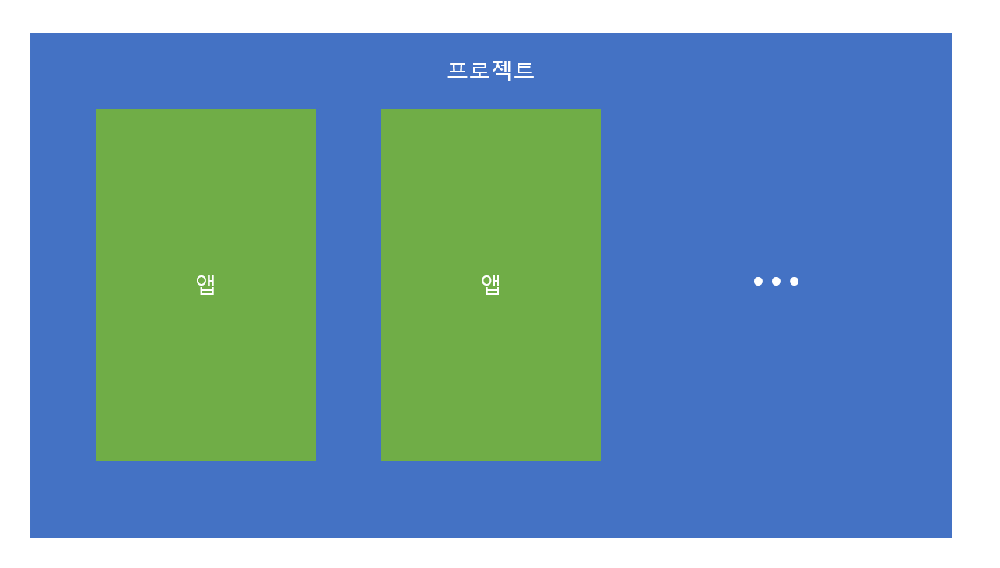
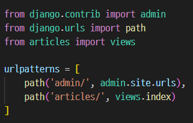
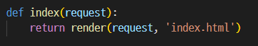
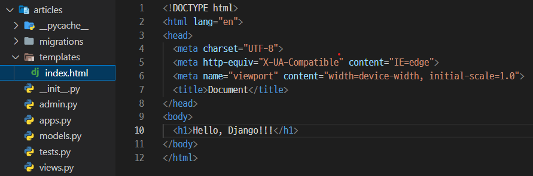

# 디자인 패턴

## 프로젝트와 앱

Django에는 `프로젝트`와 `앱`이 있다.

프로젝트는 `애플리케이션의 집합`으로 주로 DB설정, URL연결, 전체 앱 관리 등을 처리한다.

앱은 `독립적으로 작동하는 기능 단위의 모듈`이다. 각자 특정한 기능을 담당하며 다른 앱들과 함께 하나의 프로젝트를 구성한다.

예를 들면, 프로젝트를 블로그라고 한다면 앱은 게시글, 댓글, 회원관리 등이 있겠다.

## MVT

SW개발에서 널리 쓰이는 디자인 패턴인 `MVC (Model, View, Controller)`가 있다.

하지만 Django에서는 `MVT (Mode, View, Template)`으로 규정한다.

Controller -> View , View -> Template 으로 바뀐것이다.

MVT로 사용하는 이유는 다음과 같다.

View는 사용자에게 보여지는 데이터를 설명한다. 데이터가 "어떻게" 보여지는지가 아니라 `"어떤" 데이터`가 보여지는가 에 초점을 둔 것이다.

따라서, Django에서의 View는 특정 URL에 대해 어떤 데이터를 보여주는지를 설명하는 파이썬 콜백 함수로 나타낸것이다.

그리고 사용자에게 보여지는 데이터는 `Template으로 어떻게 데이터가 보여질 지`를 나타낸다.

## 요청과 응답

클라이언트가 'articles/' 페이지를 요청을 하면 서버에서는 urls.py의 `urlpatterns` 리스트에 있는지 확인을 한다.

- urls.py

그러면 해당하는 앱의 views 모듈의 `index` 뷰 함수를 호출한다.

- views.py

index 함수는 request를 인자를 받는다.

그리고 해당 request에 대한 응답으로 `'articles/index.html'`을 보낸다.

- templates/

클라이언트에게 보낼 `'articles/index.html'`은 templates 디렉터리에서 찾을 수 있다.

Django에서는 template을 인식하는 규칙은

`'app/templates/'가 default path`로 인식하기에 그 다음의 경로를 작성해야 한다.

그렇기에 './templates/articles.index.html'이 아닌 'articles.index.html'로 작성한것이다.

## 데이터 흐름

클라이언트가 요청을 보내면

URLs -> View -> Template 순으로 작동한다.

path('articles/', `views.index`),

def `index`(request):
    return render(request, `'articles/index.html'`)

articles/templates/`articles/index.html`