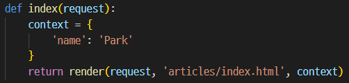
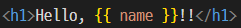

# Template System

## DTL

Django에는 `Template System`이 존재한다.

Template System은 데이터 `표현`을 제어하면서, `표현`과 관련된 로직을 담당한다.

마치 html을 프로그래밍 언어처럼 사용할 수 있도록 도와준다.

### Variable

```html
<body>
  <h1>Hello Django!!!</h1>
</body>
```

Django를 Park으로 바꾸기 위해서는 `view 함수`를 조작해야한다.



`context` 딕셔너리에 `key와 value를 지정`해주고 응답으로 context를 넘겨준다.



넘겨준 딕셔너리의 `key값`을 `{{ }}`에 넣어주면 `value가 출력`된다.

### Filter

변수를 수정하기 위해서는 `Filter`를 사용한다.

`|`로 표현하며, `chained`가 가능하기에 이어서 사용이 가능하다.

```html
{{ name|truncatewords:30 }}
```

### Tag

`반복` 또는 `논리`를 수행하여 `제어흐름`을 만드는 일은 `Tag`를 사용한다.

```html
 
```

## 템플릿 상속

템플릿에 공통된 요소를 매번 적는것은 비효율적이다. (e.g. bootstrap CDN)

이런 경우는 base문서를 따로 빼서 상속 구조를 만들어주는 것이 유지보수나 재사용성에서 도움이 된다.

base.html에 공통된 요소를 작성하고 상속 할 부분을 block처리해준다.

```html
<head>
  <!-- boostrap CDN ... -->
</head>
<body>
  
  
  <!-- bootstrap CDN -->
</body>
```

그리고 상속받을 하위 템플릿에는

```html


  <!-- 작성 할 코드 -->

```

block태그에 overriding 해준다

## 요청과 응답

구글이나 네이버 등의 사이트에서 로그인을 하기위해 아이디와 비밀번호를 입력하고 로그인 버튼을 누르면 로그인이 된다.

그렇다면 입력한 아이디와 비밀번호를 서버가 어떻게 처리할까?

이럴때는 HTML form elemet를 통해 요청과 응답을 주고받는다.

### form

form 요소는 클라이언트로부터 할당된 데이터를 서버로 전송해주는 역할을 한다.

그렇다면 form 요소는 데이터를 어디로 어떤 방식으로 보낼까?

이 부분을 form의 핵심 속성인 action과 method가 수행한다.

- action
  - 입력 데이터가 전송될  URL을 지정한다.
  - 만약 action값을 지정하지 않으면 현재 URL을 지정한다.
- method
  - 데이터를 어떤 방식으로 보낼 것인지를 정의한다.
  - HTTP request methods인 GET, POST가 있다.
  - 기본값은 GET을 지정한다.

```html
<form action="URL", method="GET">
  <!-- code -->
</form>
```

### input

이제 입력을 받아보자.

사용자가 input태그에 입력한 데이터를 어딘가에 담아둬야 한다.

이 때 사용하는 속성이 input의 핵심 속성인 name이다.

데이터를 제출했을 때 서버는 name속성에 설정된 값을 통해 사용자가 입력한 데이터에 접근할 수 있게 된다.

```html
<form action="", method="GET">
  <input name="message">
  <button type="submit">Submit</button>
</form>
```