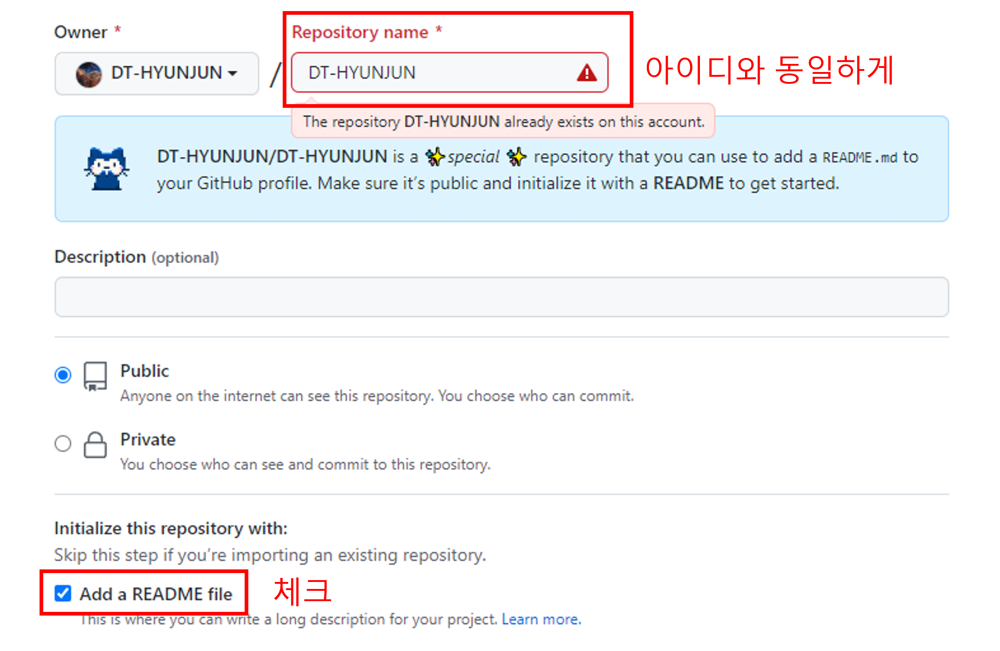
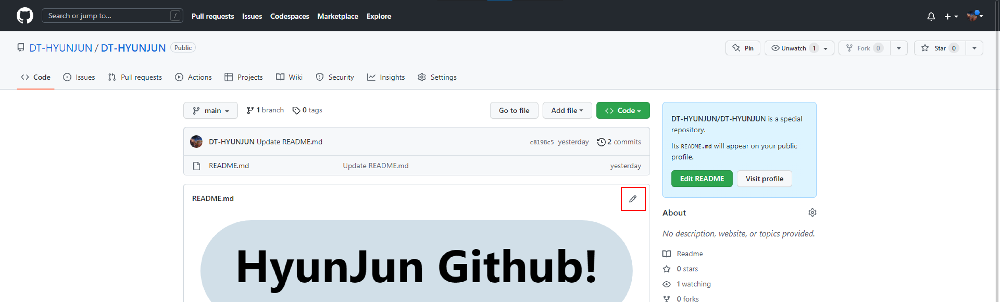
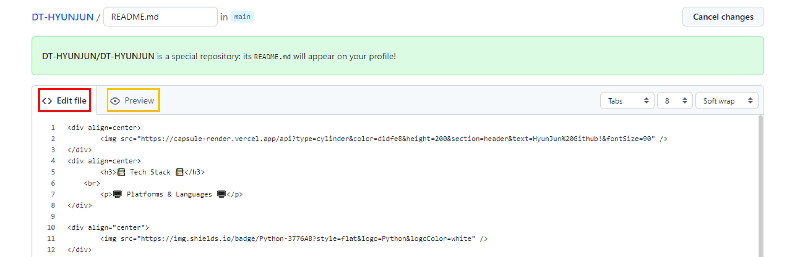
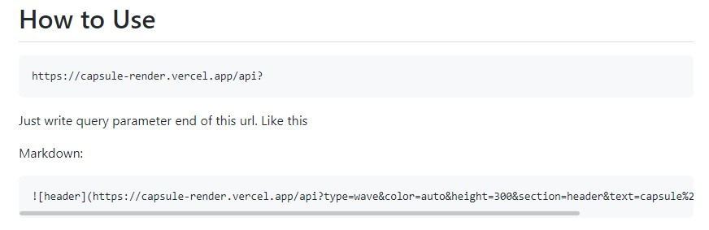
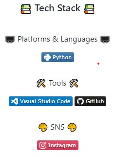
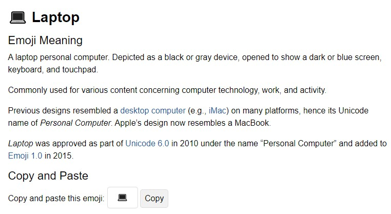

## [go to README](../README.md) <br>
## [go to Markdown](markdown.md) 
## [go to Git](git.md) <br></br>

<div align=center>
		
</div>


# Github README 꾸미기
혼자 꾸미다 보니 재밌어서 혼자 연습할 겸 여러분들과 같이 공유하고 싶은 마음에 작성해 봅니다!
<br></br>

## `README repository 생성하기`



아이디와 동일한 이름의 repository 생성 / Add a README file 체크!
<br></br>



수정 버튼을 눌러줍니다.
<br></br>


<span style="color:#FF4848">코드 구역</span>과
<span style="color:orange">프리뷰 구역</span>으로 나뉘게됩니다.

<br></br>
## `README 헤더`


[kyechan99/capsule-render](https://github.com/kyechan99/capsule-render)

이곳에서 다양한 스타일의 헤더를 꾸밀 수 있습니다.

사용법 또한 자세해서 따라 하기 쉬울 겁니다.
 


``

타입 / 색상 / 높이 / 텍스트 / 글자크기를 취향대로 바꾸시면 됩니다.

## `README 뱃지`

<br>
<div align=center>


</div>

[simpleicons](https://simpleicons.org/)

이곳에서 뱃지를 추가할 수 있습니다.


추가하실 뱃지의 `이름`, `색상코드`를

```html

```
알맞게 적어주시면
```html

```


이렇게 나타납니다.
<br></br>
참고로 중앙 정렬은
```html
<div align="center">
		
</div>
```
줄바꿈은
```html
<br></br>
```
저도 html을 배운적이 없어서 무슨 뜻인지는 모르겠지만

이런 식으로 해주면 되더라고요.

추후에 html/css 강의시간에 배우면 될 거 같아요!

## `Header 이모티콘`

[emojipedia](https://emojipedia.org/search/?q=)에 들어가셔서

원하시는 이모티콘 검색하신 후


copy 누르셔서 복사하신 후 붙여넣기 하시면 됩니다.