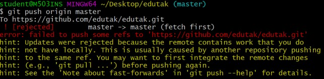

## [README](../README.md) <br>
## [Markdown](markdown.md) 
## [Decoration](decorate.md) 🎨
## [Career](book/career.md) 👨‍💻<br></br>
# Git
## 목차
1. [기본명령어](#기본-명령어---init)
2. [원격저장소](#원격-저장소---설정)
3. [Branch](#branch)
4. [Shared Repository Model](#shared-repository-model)
5. [Fork & Pull Request Model](#fork--pull-request-model---fork--clone)

## git이란?
git은 분산버전관리시스템으로 코드의 버전을 관리하는 도구

## 기본 명령어 - init
- 특정 폴더를 git 저장소를 만들어 git으로 관리
    - .git 폴더가 생성
    - git bash에서는 (master)라는 표기를 확인

## 기본흐름
1. 작업을 하고
2. 변경된 파일을 모아 (add)
3. 버전으로 남긴다 (commit)

- Git 파일은 modified, staged, committed로 관리
    - modified : 파일이 수정된 상태 (add 명령어를 통하여 staging area로) `1통`
    - staged: 수정한 파일을 곧 커밋할 것이라고 표시한 상태 (commit 명령어로 저장소) `2통`
    - committed : 커밋이 된 상태 `3통`

## 기본 명령어 - add
```
$ git add <file>
```
- working directory상의 변경 내용을 staging area에 추가하기 위함
    - untracked / modified 상태의 파일을 staged로 변경

## 기본 명령어 - commit
```
$ git commit -m '<커밋메시지>'
```
- staged 상태의 파일들을 커밋을 통해 버전으로 기록
- 커밋 메시지는 변경 사항을 나타낼 수 있도록 명확하게 작성해야 함
- 변경된 부분만 저장하기에 매우 크기가 작음

## 기본 명령어 - log
```
$ git log
```
- 현재 저장소에 기록된 커밋을 조회
- 다양한 옵션을 통해 로그를 조회할 수 있음
```
$ git log -1                # 로그를 하나만 출력
$ git log --oneline         # 로그를 한 줄에 출력
$ git log -1 --oneline      # 하나의 로그를 한 줄에 출력
```

## 기본 명령어 - status
```
$ git status
```
- Git 저장소에 있는 파일의 상태를 확인하기 위하여 활용
    - 파일의 상태를 알 수 있음
        - Untracked files
        - Changed not staged for commit
        - Changes to be committed
    - Nothing to commit, working tree clean

## 원격 저장소 - 설정
```bash
$ git remote add origin URL
```
- URL을 origin이란 이름으로 대신

```bash
$ git remote -v
```
- 단축이름과 URL을 확인 가능

## 원격 저장소 - push / pull
```bash
$ git push origin master
$ git pull origin master
```
- 원격 저장소로 변경 사항(commit)을 올림(push)
    - 원격 저장소는 로컬의 파일/폴더가 아닌 **버전(commit)** 을 관리

## 원격 저장소 - clone
```bash
$ git clone <원격저장소주소>
```
- 원격 저장소를 복제하여 가져옴
    - clone : 원격 저장소 복제
    - pull : 원격 저장소 커밋 가져오기

## Push 실패
- 협업을 하다보면 아래의 메시지를 확인하게됨
<br>


- 이는 로컬과 원격 저장소의 커밋 이력이 다른 경우<br>

해결법<br>
1. 원격 저장소의 커밋을 로컬 저장소로 가져옴(pull)
2. 로컬에서 두 커밋을 병합(추가 커밋 발생)
    - <span style="color:#FF4848">동시에 같은 파일이 수정된 경우 merge conflict가 발생</span>
3. 다시 GitHub으로 push

## gitignore
- 프로젝트에서 버전 관리를 별도로 하지 않는 파일/폴더가 발생
- Git 저장소에 .gitignore 파일을 생성하고 해당 내용을 관리
- 작성 예시
    - 특정 파일 : a.txt
    - 특정 폴더 : /secret
    - 특정 확장자 : *.jpg
    - 예외 처리 : !b.exe
- <span style="color:#FF4848">주의! 이미 커밋된 파일은 반드시 삭제를 하여야 .gitignore로 적용</span>

### 어떤 파일을 관리?
- [개발 언어](https://github.com/github/gitignore)
    - 예시) 파이썬: venv/, 자바스크립트: node_modules/
- 개발 환경
    - 운영체제 (windows, mac, linux)
    - 텍스트 에디터 / IDE (visual studio code 등)
- [gitignore.io](https://gitignore.io) - .gitignore 파일 만든는 사이트

## Branch
- 독립적인 작업흐름을 만들고 관리

### Branch 주요 명령어
1. Branch 생성
```bash
(master) $ git branch {name}
```
2. Branch 이동
```bash
(master) $ git checkout {name}
```

3. Branch 생성 및 이동
```bash
(master) $ git checkout -b {name}
```

4. Branch 목록
```bash
(master) $ git branch
```

5. Branch 삭제
```bash
(master) $ git branch -d {name}
```

## Branch - merge
- 각 branch에서 작업을 한 이후 이력을 합치기 위해 merge 명령어를 사용
- 병합을 진행할 때, 서로 다른 이력(commit)에서
    - 동일한 파일을 수정한 경우 충돌이 발생
        - 이 때는 반드시 직접 해당 파일을 확인하고 적절하게 수정
        - 수정한 이후에 직접 커밋 실행
    - 다른 파일을 수정한 경우
        - 충돌 없이 자동으로 Merge Commit이 생성됨

## Branch - merge - fast forward
 - 기존 master 브랜치에 변경사항이 없어 단순히 앞으로 이동

 ## Shared Repository Model
 ```
 👑: repository owner (project manager)

 👨‍💻: contributor
 ```

 ### STEP 0 - 팀원 초대 및 저장소 clone
 1. 👑: 👨‍💻을 collaborator로 등록
 2. 👨‍💻 : clone 이후 작업 환경 설정을 마무리 한다

 ### STEP 1 - branch 작업 및 GitHub push
 1. 👨‍💻 : 작업은 항상 독립적인 branch에서 한다
    - master branch는 항상 배포 가능한 상태 유지
2. 👨‍💻 : Commit으로 작업의 이력(history)을 남긴다
    - commit 메시지는 일관된 형식으로 쉽게 파악하도록 작성
3. 👨‍💻 : 완성된 코드는 원격 저장소에 push 한다.

### STEP 2 - Pull Request 생성
1. 👨‍💻 : GitHub에 들어가서 Pull Request 버튼을 누른다.
2. 👨‍💻 : PR과 관련된 설정을 진행한 후 요청을 생성한다.

### STEP 3 - Review & Merge
1. 👑 : 작성된 코드를 확인 후 병합
    - 코드 리뷰를 진행
    - merge 과정에서 충돌이 발생할 경우 해결 후 merge 진행
    - master branch로 merge의 경우 코드가 반드시 배포 가능한 상태

### STEP 4 - Merge 이후
1. 👨‍💻 : 다음 작업 준비
    - 로컬 저장소에서는 merge된 branch는 삭제하고 master branch를 업데이트
    - 이후 1~3 과정을 반복

## Fork & Pull Request Model - Fork & Clone
```
👑 : repository owner (project manager)

👨‍💻 : contributor
```

### STEP 0
1. 👨‍💻 : Forking project repository
    - 원격 저장소를 fork 한다.
    - 내 저장소로 복제본을 가져옴으로써 로컬에서 작업 후 원격 저장소로 push 하는것
2. 👨‍💻 : Clone 이후 작업 환경 설정을 마무리  한다
    - <span style="color:#FF4848">Clone시 반드시 본인 저장소인지 확인</span>

### STEP 1 ~ STEP 3
- SRM과 동일

### STEP 4
1. 👨‍💻 : 다음 작업 준비
    - 로컬 저장소에서는 merge된 branch는 삭제하고 master branch를 업데이트
        - <span style="color:#FF4848">단, master branch는 원본 저장소를 받아와야 하며 별도의 원격 저장소를 추가하여 진행 가능</span>
        - <span style="color:#FF4848">혹은 GitHub에서 fetch upstream도 가능</span>