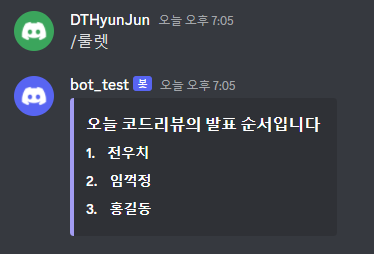

# 🔄재귀함수

다음주 스터디 코드리뷰 주제가 재귀함수이기에 재귀 문제를 풀어보았다.

백준 별찍기 - 19 문제로 재귀를 이용해 별을 찍는 문제다.

처음 문제를 풀 때는 기본 틀을 이해하기 위해 텍스트를 출력하는 재귀함수를 만들었다.

그렇게 하니 전체적인 틀을 이해하는데 도움이 되었다.

그리고 문제 풀이에 들어갔는데 웬걸, 재귀가 문제가 아니라 구현하는게 어려웠다.

재귀는 그냥 마지막에 계속 불러와서 별을 찍는 형식이라 단순했지만 그 별을 찍는 과정에서

규칙을 알아내는게 관건이었다.

그래도 별 찍기 문제는 예제 출력을 보면 규칙은 비교적(?) 쉽게 알아낼 수 있어서

종이에다가 풀고 코드를 받아적는 형식으로 진행하니 나름 괜찮게 풀었다.

내일도 재귀문제를 풀어야겠다.

# 💻디스코드 봇 개발

오늘은 주말이기에 백준 스터디 채널 디스코드 봇을 만들어 보았다.

내가 속한 백준 스터디에서는 매주 목요일마다 각자 뽑은 문제 모두 풀어보고 코드리뷰하는 식으로 진행한다.

사실 봇을 만드는 결정적인 계기는 발표 순서를 정하기 위함이다.

원래는 조장님이 파이썬 코드로 만들어서 이용중이었는데

굳이 룰렛 하나 돌리기 위해 프로그램을 실행하기 번거로워서

개발을 시작했다.

내가 구상한 전체적인 틀은 4가지 기능이다.

1. 룰렛 : 코드리뷰 순서 정하기
2. 백준문제추가 : 코드리뷰 할 백준 문제를 추가하고 링크 보내기
3. 백준문제삭제 : 추가한 문제를 삭제하기
4. 문제리스트 : 추가한 문제의 리스트를 보내기

디스코드 봇은 원래 있는 기능이어서 구글에 자료도 많기에 그리 어렵지는 않았다.

기본 메시지로 전송하기되면 예쁘지 않아서 embed 형식으로 묶어서 보내면 사진처럼 예쁘게 보낼 수 있다.